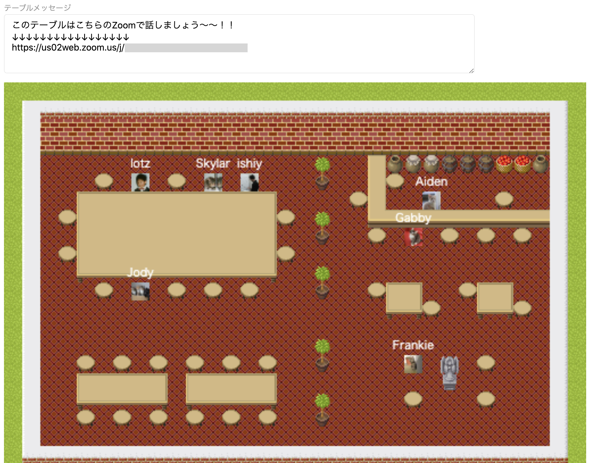

# Remote House

See also [Gather](https://gather.town/).

----

新型コロナウィルスの影響で外出自粛が続く昨今、Zoomなどのビデオ会議ツールが重宝されるようになりましたが物理的なインタラクションが無いことで人に話しかけたり話しかけられるといった会話に移行する前段階のコミュニケーションが難しくなっています。このWebアプリはリモート環境が当たり前の世の中でも人に話しかけやすい雰囲気を作ったり、みんながどこで話してるのかが分かったり、逆に今は集中しているから話しかけないでといった情報を匂わせることができるような空間を提供します。バーチャルオフィスやバーチャル飲み会の時に集まる場所として使っていただけると幸いです。



## 哲学

- SlackやZoomのようなコミュニケーションツールの前段で使われる
- ノンバーバルなコミュニケーションを奨励して情報の仄めかしが生まれやすい環境を作る

現在はプライベートなネットワーク環境もしくは限定URLを使って利用するスタイルを想定しています。

## 導入方法

```shell
$ git clone git@github.com:lotz84/remote-house.git
$ cd remote-house
```

### stack & spago

事前にHaskellのビルドツールである[stack](https://docs.haskellstack.org/en/stable/README/)とPureScriptのビルドツールである[spago](https://github.com/purescript/spago)使える状態にしておく

```shell
$ spago bundle-app --main Main --to frontend/static/main-ps.js
$ stack run
```

### Docker

```shell
$ docker build -t remote-house .
$ docker run -p 8080:8080 remote-house
```

### Heroku

[](https://heroku.com/deploy)

## 開発

このアプリはまだまだ開発途中なのでIssueやPull Requestは大歓迎です。

バックエンドにはHaskell - Servant、フロントエンドにはJavaScript - Vue.jsとPureScriptを利用しています。

マップの画像は「ぴぽや <https://pipoya.net/>」で配布されている素材を利用しています。RPG画像は自由に組み合わせれるので開発がしやすいですが、ゲームの雰囲気になってしまうのでバーチャルオフィス用途も想定した画像を用意したいと考えています。

その他、今後追加したいと考えている機能です。

- [ ] PostgreSQL, Redis対応
- [ ] マップの編集
- [ ] プロフィール画像のアップロード
- [ ] 開閉できる扉などのギミック
- [ ] ログイン機能
- [ ] モバイル対応
